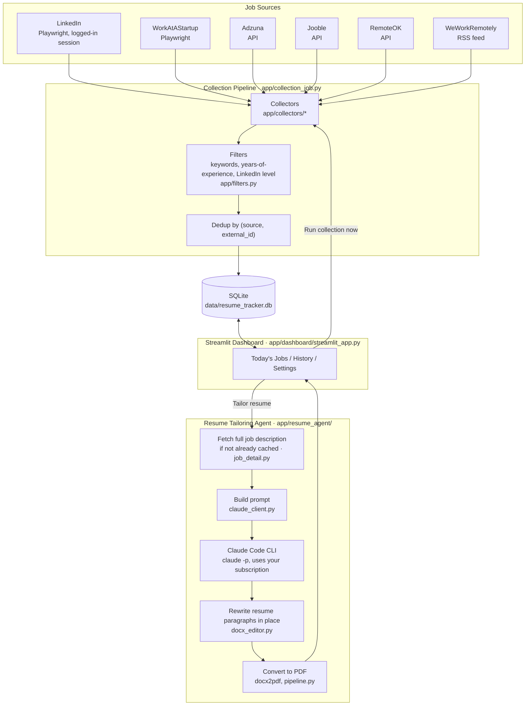

# Job Tracker & Resume Tailoring Agent

Collects job postings from the last 24 hours (LinkedIn + free job-board APIs) into
one Streamlit dashboard, with the title, company, location, and a direct link to
each posting. Nothing is ever auto-submitted anywhere — every source redirects to
a page with its own layout that can't be reliably auto-filled, so "Apply" just
opens the link for you and marks it as opened. A separate per-job agent can also
tailor your resume to a specific posting on demand (see [Resume tailoring](#resume-tailoring)).

The "last 24 hours" window is computed fresh every time collection runs, not tied to
a fixed schedule — so the way to use this is just opening the dashboard and clicking
**"Run collection now"** whenever you're at your laptop. No background process or
scheduled task is required for that to work correctly.

**Note:** scraping LinkedIn's search results goes against their Terms of Service and
risks your account being flagged. This tool never submits anything on your behalf,
but the collection itself still carries that risk, which is yours to accept.

## Job Sources

| Source | How it's collected | Key needed? |
|---|---|---|
| [LinkedIn](https://www.linkedin.com/jobs/) | Playwright, using your own logged-in session | No — manual login, see below |
| [Adzuna](https://www.adzuna.in/) | Free API | Yes, free |
| [Jooble](https://jooble.org/) | Free API | Yes, free |
| [RemoteOK](https://remoteok.com/) | Free API | No |
| [We Work Remotely](https://weworkremotely.com/) | Public RSS feed | No |
| [Work at a Startup](https://www.workatastartup.com/) (Y Combinator's job board) | Playwright, public listings | No |

Each source can be individually enabled/disabled on the Settings page. Adzuna and
Jooble are silently skipped if their API key isn't set in `.env`.

## Architecture



Everything runs locally, triggered manually from the dashboard — no scheduler, no
cloud hosting, no server to keep alive.

## Tech Stack

| Layer | Choice | Why |
|---|---|---|
| Language | Python 3.10+ | |
| Dashboard | [Streamlit](https://streamlit.io/) | Fast to build, runs locally, free |
| Browser automation | [Playwright](https://playwright.dev/) | Drives a real Chromium for LinkedIn/WorkAtAStartup, where no free API exists |
| HTTP / feeds | [httpx](https://www.python-httpx.org/) | Adzuna, Jooble, RemoteOK APIs, and the WeWorkRemotely RSS feed |
| Database | SQLite via [SQLAlchemy](https://www.sqlalchemy.org/) | Zero-config, file-based, plenty for a single-user tool |
| Config | [Pydantic](https://docs.pydantic.dev/) / pydantic-settings | Typed settings (`data/settings.json`) and secrets (`.env`) |
| Resume editing | [python-docx](https://python-docx.readthedocs.io/) | Rewrites paragraph text in place, preserving original formatting |
| DOCX → PDF | [docx2pdf](https://pypi.org/project/docx2pdf/) | Drives Microsoft Word in the background for a layout-accurate PDF |
| LLM | [Claude Code CLI](https://code.claude.com/docs) (`claude -p`) | Uses your existing Claude subscription — no separate API key or billing |
| Tests | [pytest](https://pytest.org/) | |

## Prerequisites

- **Python 3.10+**
- **Microsoft Word** — only needed for the resume-tailoring feature's DOCX → PDF conversion (skip if you won't use that)
- **[Claude Code](https://code.claude.com/docs)** installed and logged in (`claude` on PATH) — only needed for resume tailoring, not for job collection

## Installation

```
git clone https://github.com/ranjan162003/resume_tracker.git
cd resume_tracker

python -m venv .venv
./.venv/Scripts/activate        # Windows PowerShell: .venv\Scripts\Activate.ps1
pip install -r requirements.txt
python -m playwright install chromium

cp .env.example .env            # fill in any API keys you have (see below)
```

Free API keys (optional, only needed for the sources you enable):
- Adzuna: https://developer.adzuna.com/
- Jooble: https://jooble.org/api/about
- RemoteOK needs no key.

**LinkedIn needs no key or password in `.env` at all.** The first time it's used (or
whenever the saved session expires), use the **"Login to LinkedIn"** button on the
Settings page — a visible browser window opens on LinkedIn's own login page and waits
for you to log in yourself. Only the resulting session is saved to
`data/storage_state.json` (gitignored) — your password is never written to disk.
(If your LinkedIn account only uses "Sign in with Google," add a direct LinkedIn
password first under LinkedIn's own Settings → Sign in & security — Google blocks
its sign-in flow from automated browsers.)

## Run

```
python run_dashboard.py
```
Opens **http://localhost:8501** automatically (or open it manually if not).

Then:
1. Go to **Settings** and set your keywords, location, enabled sources, and (optionally) your resume path
2. Click **"Run collection now"** in the sidebar to pull in the last 24 hours (or 48h/72h/7 days, adjustable in the sidebar) of postings
3. Browse **Today's Jobs**, open postings to apply, or click **"Tailor resume"** per job

There's no background process to keep running — collection is triggered by that one
button, and the lookback window is computed fresh at whatever moment you click it.

## Resume tailoring

Each job card has a **"Tailor resume"** button. Given a job's description and your
resume, it rewrites the objective/summary and a few relevant bullets to match that
posting -- it only rephrases content that's already truthfully in your resume, never
invents new skills, employers, or experience.

Requirements:
- A `.docx` resume, set via the **"Browse for your resume"** uploader on the Settings
  page (saved locally to `data/resume/`).
- [Claude Code](https://code.claude.com/docs) installed and logged in (`claude` on
  PATH) -- resume tailoring calls it non-interactively (`claude -p`), which uses your
  existing subscription's usage allowance, not a separate paid API.
- Microsoft Word, for converting the tailored `.docx` to a layout-accurate PDF via
  [docx2pdf](https://pypi.org/project/docx2pdf/).

For LinkedIn and WorkAtAStartup, whose job listings don't include a description in
the collected data, the description is fetched from that one job's page on first
use and cached -- not re-fetched on later clicks.

## Tests
```
pytest
```
